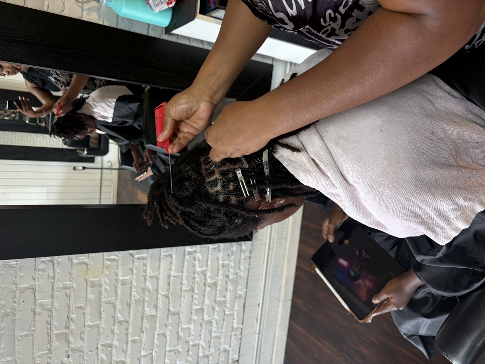

# COMBED

**Know your chair. Work it smarter.**

<p align="center">
  
  
  
</p>

COMBED turns the handwritten appointment book a stylist already uses into clear answers about her schedule, pricing, services, revenue patterns, and time.

It reads photos of the book, combines what it finds with the business knowledge only the stylist has, adds local-market context, and produces a plain-language plan for the next 20 days.

**Built for longtime independent hairstylists who know hair, not spreadsheets.**  
First test user: an old-school salon in North Highlands, California.

> Built at Claude Build Day and recognized with a special COMBED project award.

---

## The problem

My mom has been doing hair for years. She knows her clients, her services, and her chair — but the business data was living in a handwritten appointment book.

That means questions like these are harder than they should be:

- Which days actually bring in the most?
- Which services are doing the heavy lifting?
- Are prices consistent?
- Where are the gaps in the next few weeks?
- What should change first if the goal is to earn smarter, not simply work more?

COMBED is my attempt to turn the system she already uses into something that can answer those questions.

---

## What COMBED does

```text
Appointment-book photos (cursive)
        ↓
Vision reading, one page at a time
        ↓
Structured appointments
  ├── confidence ≥ 85% → analysis
  └── lower confidence → Review for Later Analysis
        ↓
Business calculations
  + local-market signals from Apify
  + AI reasoning
        ↓
YOUR CHAIR, COMBED
        ↓
A plain-language plan for the next 20 days
```

The report covers:

1. **Your Chair Cone** — appointments, observed gross revenue, average ticket, top booked service, and analysis coverage
2. **What your chair is telling you** — a short synopsis grounded in the numbers
3. **What each day brought in** — observed revenue by working day
4. **Which services brought the most into your chair** — ranked by observed revenue
5. **Are your prices working as hard as you are?** — price consistency by service
6. **What’s worth your energy?** — money vs. physical effort once the stylist adds typical service times
7. **Where your chair is working hardest** — appointment-start patterns by weekday
8. **What’s happening around your chair** — local market signals
9. **Your Next 20 Days** — up to four moves and one measurable goal
10. **Review for Later Analysis** — entries that were not read confidently enough to include

---

## Honest by design

A big part of this build was deciding what **not** to infer.

- A time written in the book is an appointment **start time**, not a service duration.
- COMBED does not show revenue per hour until the stylist supplies typical service times.
- Client names are replaced with `Client 01, 02, …` before they reach the report or server.
- Discounted visits are separated, not judged.
- Gross revenue is never called profit.
- Recommendations include the supporting numbers behind them.
- If the market lookup fails, the report still renders.
- If the AI step fails, the report falls back to calculated metrics and a rule-based narrative.

---

## Stack

- **Frontend:** HTML, CSS, JavaScript
- **Server:** Node + Express
- **Vision + reasoning:** Claude-compatible Messages API
- **Local market context:** Apify
- **Demo mode:** anonymized sample appointments + fictional local places
- **Safety:** server-side secrets, upload normalization, confidence threshold, immediate client anonymization

---

## Project layout

```text
index.html            customer-facing app
css/styles.css        COMBED brand system
js/config.js          dates, vocabulary, confidence threshold, upload rules
js/ingest.js          time interpretation, service grouping, anonymization
js/calc.js            business calculations
js/narrative.js       rule-based fallback narrative
js/render.js          single report render path
js/app.js             upload → read → review → goals → analyze → report
js/mock-data.js       anonymized sample appointments
js/mock-market.js     fictional local places for offline demo mode
server.js             Express server + API routes
lib/extract.js        appointment-book vision extraction
lib/apify.js          local-market lookup + normalization
lib/report.js         AI report generation + strict JSON handling
```

---

## Run it locally

Requires **Node 20.12+**.

```bash
npm install
cp .env.example .env
npm start
```

Default: `http://localhost:3000`

If port 3000 is busy:

```bash
PORT=3210 npm start
```

### Environment variables

| Variable | Purpose |
|---|---|
| `MODEL_API_KEY` | Vision + report-generation API key |
| `MODEL_NAME` | Model name |
| `MODEL_API_URL` | Messages API endpoint |
| `APIFY_API_TOKEN` | Server-side Apify token |
| `APIFY_ACTOR_ID` | Actor used for local-market lookup |
| `APIFY_MAX_RESULTS` | Result cap for faster live runs |
| `PORT` | Local server port |

`.env` is git-ignored. Never commit keys.

---

## Demo mode

Switch the toggle above **Comb my business** to *Demo* to run the report offline with labeled sample data and fictional local places.

Demo and live mode use the same render path.

---

## Using real appointment-book photos

1. Drop up to six page photos into the upload box.
2. Press **Read my book**.
3. Entries read at **85%+ confidence** are included automatically.
4. Lower-confidence rows are routed to review instead of being silently guessed.
5. Press **Comb my business**.

Accepted upload behavior lives in `CONFIG.UPLOAD` inside `js/config.js`.

---

## How the calculations work

Observed gross revenue is the sum of readable dollar amounts written next to appointments.

Average ticket is:

```text
observed gross revenue ÷ appointments with a readable amount
```

For each service, COMBED tracks the observed price range. Visits marked **Family Discount** are separated before a price is treated as standard.

A day’s spread is the time between the first and last appointment **start**, not estimated labor hours.

Only after a stylist supplies typical service durations can COMBED estimate:

- service hours
- revenue per estimated hour
- target hourly rate
- a sustainable price signal

Those values are labeled as estimates.

---

## Roadmap

- compare consecutive 20-day periods: **observe → recommend → change → measure**
- make stylist-supplied service-duration profiles a first-class setup step
- learn a broader service vocabulary from each stylist’s own book
- strengthen review workflows for ambiguous handwritten entries
- package the workflow for additional independent stylists

---

COMBED started with one chair and one handwritten book. The bigger idea is simple: **small businesses already have data — sometimes it just does not look like data yet.**
